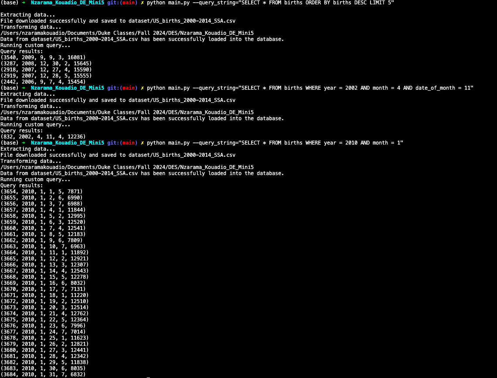

## Mini Project 5: SQLite Lab
[](https://github.com/nogibjj/Nzarama_Kouadio_DE_Mini5/actions/workflows/cicd.yml)

# Births Database CRUD Operations with SQLite

This project demonstrates basic CRUD (Create, Read, Update, Delete) operations on a table displaying the number of births in the US from 2000 to 2014 using a SQLite database in Python. It includes a Python script that supports querying the database and a test file to validate the functionality.

# Project Overview

The main script connects to an SQLite database and performs the following operations:

**Extract** : Download and extract the dataset (US Births).

**Load** : Load the extracted dataset into the SQLite database.

**Read** : Query the births table to retrieve specific records, with flexibility for custom SQL queries.


# Important Folders in our Project

```
..
├── mylib/                     # Python library containing main functions
│   ├── extract.py             # Function to extract data from a dataset
│   ├── transform_load.py      # Function to load data into SQLite
│   ├── query.py               # CRUD functions (Create, Read, Update, Delete)
├── main.py                    # Main Python script for extraction, loading, and querying
├── test_lib.py                # Test file for core functions
├── README.md                  # Project documentation
├── requirements.txt           # Dependencies (fire, sqlite3)
└── .github/
    └── workflows/
        └── ci.yml             # GitHub Actions CI/CD pipeline
```
# Table Structure

The births table has the following columns:

`id`: Unique identifier for each record (auto-incremented).

`year`: Year of birth (integer).

`month`: Month of birth (integer).

`date_of_month`: Day of the month (integer).

`day_of_week`: Day of the week (integer).

`births`: Number of births (integer).

# Setup Instructions

- Clone the repository: git clone
- Install dependencies: pip install -r requirements.txt
- Run main.py
- Run test_lib.py: run tests for extract, load, and query functionality


# CRUD Operations

All CRUD operations are implemented in query.py in the my_lib.py folder:

**Create** : Implemented as create_birth_record(), which inserts a new birth record into the database.

**Read** : Implemented as read_top_records() and query_data(), which retrieves records from the database (default and custom queries).

**Update** : Implemented as update_birth_record(), which updates the number of births for a specific record based on the record's ID.

**Delete** : Implemented as delete_birth_record(), which deletes a record from the births table based on the record's ID.

# SQL Queries

The project includes two SQL queries:

- Default Query: SELECT * FROM births LIMIT 5
- Custom Query: You can pass any SQL query via the command line using Fire.

# Example of Queries Output

Here are some example queries executed using the `main.py` script, showing the results for different SQL queries:

**Example 1**: Run the default query (top 5 rows)

**Example 2**: Fetch births data on April 11, 2002

**Example 3**: Query ouput for all January 2010 Births


